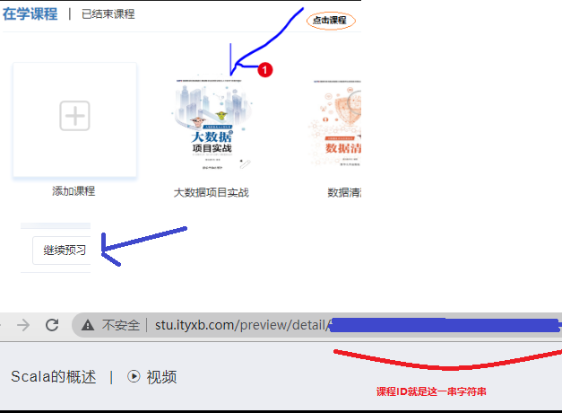

# 下载脚本

1. 传智视频下载脚本： [下载传智视频.py](./download_czsp.py)
> 使用方法    
> 拿到自己的cookie和需要下载的课程ID
> 
> 

运行python脚本
```sh
python3 下载传智视频.py

# 命令行提示输入cookie和课程ID，以此填入即可
```

也可以修改脚本文件将cookie和课程ID填进去
```python

if __name__ == '__main__':
    
    # 拿到自己的账号COOKIE
    cookie = '{cookie}'
    # 输入你要下载的课程ID
    subject_id = '{课程ID}'
```
运行脚本即可
```sh
python3 下载传智视频.py
```
